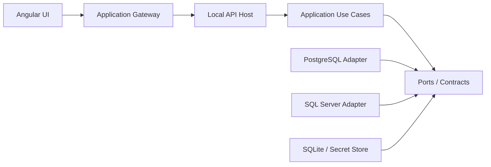

# Plan de trabajo — Druse

## 1. Objetivo del proyecto

Construir **Druse**, una aplicación de escritorio para administrar y consultar diferentes motores de bases de datos mediante una interfaz moderna y personalizable.

El primer producto funcional debe permitir:

- Crear y probar conexiones.
- Conectarse inicialmente a PostgreSQL y SQL Server.
- Explorar bases, esquemas, tablas, vistas, funciones, procedimientos y columnas.
- Escribir SQL con resaltado de sintaxis y autocompletado.
- Ejecutar una consulta completa o solamente el texto seleccionado.
- Cancelar una consulta en ejecución.
- Mostrar resultados, mensajes y errores.
- Exportar resultados a CSV y Excel.
- Consultar el historial de ejecución.
- Guardar conexiones y preferencias localmente de forma segura.
- Instalarse como aplicación de escritorio, comenzando por Windows y manteniendo compatibilidad de compilación con Linux y macOS.

MySQL se agregará cuando la arquitectura de proveedores esté validada con PostgreSQL y SQL Server.

---

## 2. Decisión tecnológica

### Stack principal

| Componente | Tecnología | Responsabilidad |
| --- | --- | --- |
| Interfaz | Angular | Ventanas, paneles, formularios y estado visual |
| Editor SQL | Monaco Editor | Edición, resaltado, selección y sugerencias SQL |
| API local | .NET | Conexiones, metadatos, ejecución y exportaciones |
| PostgreSQL | Npgsql | Proveedor PostgreSQL |
| SQL Server | Microsoft.Data.SqlClient | Proveedor SQL Server |
| MySQL | MySqlConnector | Proveedor MySQL futuro |
| Configuración local | SQLite | Conexiones, historial y preferencias no sensibles |
| Cuadrícula | AG Grid Community o equivalente | Visualización eficiente de resultados |
| Escritorio | Tauri | Empaquetado y distribución de Angular + .NET |
| Contrato UI/API | OpenAPI | Cliente Angular generado y transporte reemplazable |
| Pruebas backend | xUnit | Pruebas unitarias y de integración |
| Pruebas frontend | Vitest/Jasmine y Playwright | Pruebas de componentes y flujos principales |

### Decisión de implementación

Durante el desarrollo inicial se ejecutarán Angular y la API .NET como aplicaciones locales separadas. Tauri se incorporará después de completar el flujo vertical principal.

```text
Angular + Monaco Editor
          |
          | HTTP local con token temporal
          v
API .NET en 127.0.0.1
          |
          v
Proveedor PostgreSQL / SQL Server / MySQL
```

La API local debe escuchar exclusivamente en `127.0.0.1` y nunca exponerse en `0.0.0.0`.

### Arquitectura elegida: hexagonal modular

El proyecto utilizará **arquitectura hexagonal modular**, también conocida como Ports and Adapters, con reglas de Clean Architecture. El objetivo no es crear capas por apariencia, sino impedir que el núcleo dependa de Angular, ASP.NET, Tauri, SQLite, Npgsql, SqlClient o del sistema operativo.

Se mantendrá como un **monolito modular local**, no como microservicios. Separar procesos o desplegar servicios remotos no aporta valor al MVP y haría más difícil distribuir, depurar y utilizar la aplicación sin conexión.



Reglas obligatorias:

- `Domain` contiene conceptos puros y no referencia infraestructura.
- `Application` contiene casos de uso y depende solamente de `Domain` y contratos.
- `Database.Abstractions` define los contratos para motores, metadatos, sesiones y consultas.
- Los proveedores implementan los contratos y encapsulan totalmente su controlador y dialecto.
- Los proveedores se registran mediante inyección de dependencias. El MVP no cargará DLL desconocidas dinámicamente, pero los contratos quedarán listos para una futura arquitectura de plugins.
- `Host.LocalApi` solamente adapta HTTP hacia los casos de uso; no contiene reglas de negocio.
- Angular consume un `ApplicationGateway`; su implementación HTTP podrá reemplazarse por IPC sin modificar componentes.
- Tauri solamente administra ventana, ciclo de vida, actualizaciones y proceso auxiliar. No contiene lógica de base de datos.
- Toda dependencia apunta hacia el núcleo. Los proyectos internos nunca conocen proyectos externos.

### Requisito de portabilidad

La base de código debe poder compilar para:

- Windows x64 y ARM64.
- Linux x64 y ARM64.
- macOS x64 y Apple Silicon.

El primer instalador estable puede publicarse para Windows, pero ninguna decisión del núcleo debe impedir construir las otras plataformas.

Para lograrlo:

- Evitar llamadas directas al registro de Windows, DPAPI, rutas fijas o separadores `\\` fuera de adaptadores de plataforma.
- Publicar la API .NET como ejecutable autocontenido para cada Runtime Identifier.
- Utilizar rutas obtenidas mediante un servicio `IAppPaths`.
- Utilizar `ISecretStore` para abstraer Windows Credential Manager, macOS Keychain y Linux Secret Service.
- Utilizar `IFilePicker`, `IAppLifecycle` e `IPlatformInfo` para capacidades del sistema.
- Mantener SQLite y los documentos de usuario en el directorio de datos correspondiente a cada plataforma.
- Ejecutar compilación y pruebas en una matriz de Windows, Linux y macOS desde integración continua.
- No utilizar autenticación integrada de Windows como única forma de conexión a SQL Server.
- Versionar el contrato OpenAPI para desacoplar frontend y host.

La palabra *portable* se utilizará en dos sentidos:

1. **Portable entre sistemas operativos:** la misma base de código produce aplicaciones nativas por plataforma.
2. **Modo portable sin instalación:** distribución ZIP opcional que guarda configuración junto al ejecutable. Este modo no guardará contraseñas por defecto; posteriormente podrá ofrecer una bóveda cifrada con contraseña maestra.

---

## 3. Alcance del MVP

### Incluido

- Aplicación de escritorio inicialmente validada en Windows y preparada para Linux y macOS.
- Tema oscuro basado en el mockup.
- Múltiples conexiones guardadas.
- PostgreSQL y SQL Server.
- Explorador jerárquico de objetos.
- Pestañas de consultas.
- Ejecución completa y por selección.
- Límite configurable de filas.
- Timeout y cancelación.
- Resultados tabulares.
- Mensajes y errores detallados.
- Exportación a CSV y Excel.
- Historial local.
- Credenciales cifradas.
- Confirmación para instrucciones destructivas.

### Fuera del MVP

- Diagramas entidad-relación.
- Comparación y sincronización de esquemas.
- Editor visual de tablas.
- Importaciones masivas.
- Túneles SSH.
- Sistema de plugins.
- Asistente de inteligencia artificial.
- Colaboración multiusuario.
- Sincronización en la nube.
- Aplicación móvil.

Estas funciones deben permanecer en el backlog para evitar que el primer lanzamiento crezca sin control.

---

## 4. Estructura inicial del repositorio

```text
druse/
├── PLAN_TRABAJO_DRUSE.md
├── README.md
├── .editorconfig
├── .gitignore
├── docs/
│   ├── architecture/
│   ├── decisions/
│   └── mockups/
│       └── druse-main.html
├── frontend/
│   └── src/app/
│       ├── core/
│       │   ├── application-gateway/
│       │   └── generated-api-client/
│       ├── shared/
│       ├── layout/
│       └── features/
│           ├── connections/
│           ├── database-explorer/
│           ├── query-editor/
│           ├── query-results/
│           ├── query-history/
│           └── settings/
├── backend/
│   ├── Druse.slnx
│   ├── src/
│   │   ├── Druse.Domain/
│   │   ├── Druse.Database.Abstractions/
│   │   ├── Druse.Application/
│   │   ├── Druse.Infrastructure/
│   │   ├── Druse.Persistence.Sqlite/
│   │   ├── Druse.Provider.PostgreSql/
│   │   ├── Druse.Provider.SqlServer/
│   │   ├── Druse.Platform.Abstractions/
│   │   ├── Druse.Platform.Native/
│   │   └── Druse.Host.LocalApi/
│   └── tests/
│       ├── Druse.UnitTests/
│       ├── Druse.ProviderContractTests/
│       └── Druse.IntegrationTests/
├── shells/
│   └── desktop-tauri/
└── build/
    ├── scripts/
    └── packaging/
```

No crear el proyecto MySQL hasta que PostgreSQL y SQL Server compartan correctamente las abstracciones comunes.

---

## 5. Diseño del backend

### Límites de los módulos

| Módulo | Puede conocer | No puede conocer |
| --- | --- | --- |
| `Domain` | Tipos y reglas del dominio | Drivers, HTTP, SQLite, Tauri, sistema operativo |
| `Database.Abstractions` | Contratos y modelos neutrales | Npgsql, SqlClient, MySqlConnector |
| `Application` | Domain y Abstractions | ASP.NET, Angular, Tauri, implementaciones concretas |
| Proveedores | Abstractions y su driver | Angular, Tauri, otros proveedores |
| `Infrastructure` | Application y adaptadores generales | Componentes de UI |
| `Platform.Native` | Platform.Abstractions y APIs nativas | Domain y reglas de consultas |
| `Host.LocalApi` | Application y composición de dependencias | Reglas de negocio nuevas |
| Angular | Contrato generado y modelos de presentación | Drivers y cadenas de conexión completas |
| Tauri | Ciclo de vida y capacidades nativas | Consultas SQL y reglas de ejecución |

### Entidades y modelos principales

- `ConnectionProfile`: nombre, motor, host, puerto, base, usuario y opciones.
- `DatabaseConnectionSession`: conexión abierta asociada a la aplicación.
- `DatabaseObject`: base, esquema, tabla, vista, función o procedimiento.
- `DatabaseColumn`: nombre, tipo, nulabilidad, clave y valor predeterminado.
- `QueryRequest`: conexión, SQL, selección, timeout y máximo de filas.
- `QueryExecution`: identificador y estado de una ejecución.
- `QueryResult`: conjuntos de resultados, mensajes, duración y filas afectadas.
- `ResultSet`: columnas y filas devueltas.
- `QueryHistoryEntry`: consulta, conexión, fecha, duración y resultado.

### Abstracciones necesarias

```csharp
public interface IDatabaseProvider
{
    DatabaseEngine Engine { get; }

    Task<TestConnectionResult> TestConnectionAsync(
        ConnectionProfile profile,
        CancellationToken cancellationToken);

    Task<IDatabaseSession> OpenSessionAsync(
        ConnectionProfile profile,
        CancellationToken cancellationToken);
}

public interface IDatabaseMetadataReader
{
    Task<IReadOnlyList<DatabaseObject>> GetDatabasesAsync(
        IDatabaseSession session,
        CancellationToken cancellationToken);

    Task<IReadOnlyList<DatabaseObject>> GetChildrenAsync(
        IDatabaseSession session,
        DatabaseObject parent,
        CancellationToken cancellationToken);
}

public interface IQueryExecutor
{
    Task<QueryResult> ExecuteAsync(
        IDatabaseSession session,
        QueryRequest request,
        CancellationToken cancellationToken);
}
```

Cada proveedor implementará consultas de metadatos propias. No se debe forzar una sola consulta para todos los motores porque sus catálogos y dialectos son diferentes.

### Reglas de ejecución

- Ejecutar SQL arbitrario mediante `DbCommand` y `DbDataReader`.
- No utilizar Entity Framework para ejecutar las consultas escritas por el usuario.
- Dapper puede utilizarse únicamente para SQLite y almacenamiento interno si aporta simplicidad.
- Aplicar `CancellationToken` desde el endpoint hasta el controlador del motor.
- Configurar un máximo inicial de 500 filas, modificable por el usuario.
- No agregar automáticamente `LIMIT` o `TOP` al SQL sin entender el dialecto.
- Leer resultados progresivamente y evitar cargar volúmenes ilimitados en memoria.
- Soportar varios conjuntos de resultados cuando el controlador lo permita.
- Conservar mensajes, filas afectadas, duración y excepciones normalizadas.

---

## 6. Diseño del frontend

### Módulos principales

#### `layout`

- Barra superior.
- Barra lateral de conexiones.
- Área de pestañas.
- Panel inferior.
- Barra de estado.

#### `connections`

- Modal para crear y editar conexiones.
- Prueba de conexión.
- Selector de motor.
- Indicador de estado.
- Colores para diferenciar producción, pruebas y desarrollo.

#### `database-explorer`

- Árbol con carga perezosa.
- Actualización por nodo.
- Menú contextual.
- Apertura de consultas desde tabla o vista.
- Acciones futuras para generar SQL.

#### `query-editor`

- Integración con Monaco Editor.
- Pestañas independientes.
- Ejecución completa y por selección.
- Atajos de teclado.
- Formateo.
- Estado modificado/no guardado.
- Autocompletado inicial con palabras reservadas.
- Autocompletado posterior con esquemas, tablas y columnas.

#### `query-results`

- Una pestaña por conjunto de resultados.
- Encabezados con nombre y tipo.
- Filtros locales básicos.
- Copiar celdas y filas.
- Exportación.
- Duración y filas afectadas.
- Vista separada para mensajes y errores.

### Estado de la aplicación

Para el MVP utilizar servicios Angular, Signals y RxJS. No incorporar NgRx hasta que exista una necesidad comprobada de estado global más complejo.

Estados que deben manejarse explícitamente:

- Conexiones guardadas.
- Sesiones abiertas.
- Nodo seleccionado en el explorador.
- Pestañas abiertas.
- Texto y selección de cada editor.
- Consulta activa y posibilidad de cancelación.
- Resultados asociados a cada pestaña.
- Configuración visual.

---

## 7. API local propuesta

| Método | Ruta | Finalidad |
| --- | --- | --- |
| `GET` | `/api/health` | Verificar que el proceso local está activo |
| `GET` | `/api/engines` | Listar motores disponibles |
| `GET` | `/api/connections` | Listar perfiles guardados |
| `POST` | `/api/connections` | Crear un perfil |
| `PUT` | `/api/connections/{id}` | Actualizar un perfil |
| `DELETE` | `/api/connections/{id}` | Eliminar un perfil |
| `POST` | `/api/connections/test` | Probar credenciales sin guardarlas |
| `POST` | `/api/sessions` | Abrir una sesión |
| `DELETE` | `/api/sessions/{id}` | Cerrar una sesión |
| `GET` | `/api/sessions/{id}/metadata/databases` | Obtener bases disponibles |
| `GET` | `/api/sessions/{id}/metadata/children` | Obtener hijos de un nodo |
| `POST` | `/api/queries` | Iniciar una ejecución |
| `DELETE` | `/api/queries/{executionId}` | Cancelar una ejecución |
| `GET` | `/api/history` | Consultar historial |
| `POST` | `/api/exports/csv` | Exportar resultados a CSV |
| `POST` | `/api/exports/xlsx` | Exportar resultados a Excel |

Los DTO no deben exponer contraseñas en respuestas, logs o mensajes de error.

---

## 8. Plan por fases

## Fase 0 — Preparación y decisiones

### Tareas

- [x] Crear el repositorio Git.
- [x] Copiar el mockup a `docs/mockups/druse-main.html`. _(HTML en vez de PNG: es la fuente de verdad; ver bitácora D-03.)_
- [x] Crear la solución .NET y el proyecto Angular.
- [x] Agregar `.editorconfig`, `.gitignore` y convenciones de nombres.
- [x] Documentar las decisiones principales en `docs/decisions`.
- [x] Crear ADR de arquitectura hexagonal, transporte local y estrategia multiplataforma.
- [x] Configurar reglas automáticas para impedir dependencias inválidas entre proyectos.
- [x] Definir la paleta, tipografías, espaciados e iconos a partir del mockup.
- [x] Configurar compilación y pruebas en Windows, Linux y macOS.

### Criterio de salida

La solución compila, Angular inicia, la API responde en `/api/health` y existe un único comando documentado para ejecutar ambos proyectos en desarrollo.

## Fase 1 — Shell visual basado en el mockup

### Tareas

- [x] Crear el layout general.
- [x] Implementar barra superior y barra de estado.
- [x] Crear panel redimensionable de conexiones.
- [x] Crear sistema de pestañas.
- [x] Integrar Monaco Editor con datos simulados.
- [x] Crear panel redimensionable de resultados.
- [x] Implementar tema oscuro y variables de diseño.
- [x] Crear la cuadrícula con datos simulados.

### Criterio de salida

La pantalla reproduce el mockup con proporciones, colores y comportamiento de paneles consistente, todavía sin conexión real.

## Fase 2 — Flujo vertical PostgreSQL

### Tareas

- [x] Implementar `IDatabaseProvider`.
- [x] Crear `PostgreSqlDatabaseProvider` con Npgsql.
- [x] Crear y probar una conexión PostgreSQL.
- [x] Abrir y cerrar sesiones.
- [x] Obtener bases, esquemas, tablas, vistas y columnas.
- [x] Mostrar los metadatos con carga perezosa en el árbol.
- [x] Ejecutar una consulta desde Monaco.
- [x] Mostrar columnas, tipos, filas, duración y mensajes.
- [x] Ejecutar solamente el texto seleccionado.
- [x] Cancelar consultas.
- [x] Limitar filas y configurar timeout. _(timeout fijo en 30 s; hacerlo configurable en la interfaz queda para la Fase 5.)_

### Criterio de salida

Un usuario puede conectarse a PostgreSQL, navegar hasta una tabla, ejecutar un `SELECT`, ver el resultado y cancelar una consulta larga.

## Fase 3 — Persistencia local y seguridad

### Tareas

- [ ] Crear la base SQLite local.
- [ ] Guardar perfiles sin incluir la contraseña en texto plano.
- [ ] Integrar el almacén seguro del sistema operativo para secretos.
- [ ] Guardar historial de consultas.
- [ ] Guardar pestañas recientes y preferencias.
- [ ] Implementar perfiles de color para producción, pruebas y desarrollo.
- [ ] Ocultar información sensible de logs y excepciones.
- [ ] Agregar token temporal entre Angular y la API local.
- [ ] Restringir CORS al origen de la aplicación.
- [ ] Implementar `IAppPaths` e `ISecretStore` sin dependencias del sistema operativo en Application.

### Criterio de salida

Cerrar y abrir la aplicación conserva conexiones, historial y preferencias sin almacenar contraseñas legibles.

## Fase 4 — SQL Server

### Tareas

- [ ] Crear `SqlServerDatabaseProvider`.
- [ ] Implementar autenticación SQL Server.
- [ ] Evaluar autenticación integrada de Windows como tarea separada.
- [ ] Obtener bases, esquemas, tablas, vistas, procedimientos y columnas.
- [ ] Ejecutar consultas T-SQL.
- [ ] Normalizar mensajes y errores.
- [ ] Probar múltiples conjuntos de resultados.
- [ ] Verificar timeout y cancelación.
- [ ] Ejecutar las pruebas contractuales compartidas por proveedores.

### Criterio de salida

Las mismas funciones visibles del MVP trabajan con PostgreSQL y SQL Server sin condicionales del motor dentro de los componentes Angular.

## Fase 5 — Productividad del editor

### Tareas

- [ ] Atajos para ejecutar, cancelar, guardar y crear consulta.
- [ ] Formateador SQL consciente del dialecto.
- [ ] Sugerencias de palabras reservadas.
- [ ] Sugerencias de esquemas, tablas y columnas cargadas.
- [ ] Generar `SELECT` desde una tabla.
- [ ] Copiar nombre completo del objeto.
- [ ] Abrir varias pestañas.
- [ ] Indicador de cambios sin guardar.
- [ ] Búsqueda en el editor.
- [ ] Historial filtrable.

### Criterio de salida

El flujo cotidiano de abrir conexión, localizar tabla, escribir, ejecutar y reutilizar una consulta puede completarse únicamente con teclado y pocos clics.

## Fase 6 — Resultados y exportaciones

### Tareas

- [ ] Soportar varios conjuntos de resultados.
- [ ] Copiar celdas, filas y encabezados.
- [ ] Exportar CSV con codificación configurable.
- [ ] Exportar XLSX.
- [ ] Mostrar valores `NULL` de manera diferenciada.
- [ ] Renderizar fechas, booleanos, números y binarios correctamente.
- [ ] Manejar resultados grandes sin congelar la interfaz.
- [ ] Mostrar filas afectadas para `INSERT`, `UPDATE` y `DELETE`.
- [ ] Agregar advertencias para operaciones destructivas.

### Criterio de salida

Los resultados pueden inspeccionarse y exportarse de manera confiable sin bloquear la interfaz ni perder tipos básicos.

## Fase 7 — Empaquetado de escritorio

### Tareas

- [ ] Inicializar Tauri sobre el frontend existente.
- [ ] Publicar la API .NET como ejecutable autocontenido.
- [ ] Publicar ejecutables por Runtime Identifier y arquitectura.
- [ ] Incluir la API como proceso auxiliar reemplazable de la aplicación.
- [ ] Elegir un puerto local dinámico o comunicación IPC segura.
- [ ] Finalizar correctamente la API al cerrar la aplicación.
- [ ] Crear icono, nombre, versión y metadatos del instalador.
- [ ] Generar instalador para Windows x64.
- [ ] Generar artefactos de prueba para Linux x64 y macOS ARM64.
- [ ] Crear distribución ZIP en modo portable para Windows.
- [ ] Validar instalación, actualización y desinstalación.
- [ ] Probar en un equipo sin SDK de .NET ni Node.js.

### Criterio de salida

Druse se instala y ejecuta en Windows sin que el usuario tenga que instalar Node.js, Angular CLI o el SDK de .NET.

## Fase 8 — MySQL y estabilización

### Tareas

- [ ] Crear `MySqlDatabaseProvider`.
- [ ] Implementar metadatos MySQL/MariaDB.
- [ ] Ejecutar las pruebas contractuales de proveedores.
- [ ] Corregir diferencias de tipos y mensajes.
- [ ] Crear pruebas de regresión para los tres motores.
- [ ] Medir consumo de memoria y tiempos de respuesta.
- [ ] Preparar la primera versión beta.

---

## 9. Orden recomendado para comenzar

Realizar estas tareas exactamente en este orden:

1. Crear el repositorio y guardar el mockup en `docs/mockups`.
2. Crear la solución .NET y una API mínima con `/api/health`.
3. Crear Angular y reproducir solamente la estructura principal del mockup.
4. Integrar Monaco Editor y la cuadrícula con datos simulados.
5. Definir las interfaces de proveedores y los modelos comunes.
6. Implementar prueba de conexión PostgreSQL.
7. Implementar exploración de metadatos PostgreSQL.
8. Ejecutar un `SELECT` real y mostrarlo en la cuadrícula.
9. Implementar cancelación, timeout y límite de filas.
10. Guardar perfiles e historial localmente.
11. Implementar SQL Server utilizando las mismas interfaces.
12. Empaquetar con Tauri después de estabilizar ambos motores.

La primera integración real debe ser una rebanada vertical completa. No construir todos los formularios ni todos los proveedores antes de ejecutar la primera consulta real.

---

## 10. Primeros comandos sugeridos

```bash
mkdir druse
cd druse
git init

mkdir -p backend/src backend/tests docs/mockups docs/architecture docs/decisions

dotnet new sln -n Druse -o backend   # en .NET 10 genera Druse.slnx
dotnet new classlib -n Druse.Domain -o backend/src/Druse.Domain
dotnet new classlib -n Druse.Database.Abstractions -o backend/src/Druse.Database.Abstractions
dotnet new classlib -n Druse.Application -o backend/src/Druse.Application
dotnet new classlib -n Druse.Infrastructure -o backend/src/Druse.Infrastructure
dotnet new classlib -n Druse.Persistence.Sqlite -o backend/src/Druse.Persistence.Sqlite
dotnet new classlib -n Druse.Provider.PostgreSql -o backend/src/Druse.Provider.PostgreSql
dotnet new classlib -n Druse.Provider.SqlServer -o backend/src/Druse.Provider.SqlServer
dotnet new classlib -n Druse.Platform.Abstractions -o backend/src/Druse.Platform.Abstractions
dotnet new classlib -n Druse.Platform.Native -o backend/src/Druse.Platform.Native
dotnet new webapi -n Druse.Host.LocalApi -o backend/src/Druse.Host.LocalApi
dotnet new xunit -n Druse.UnitTests -o backend/tests/Druse.UnitTests
dotnet new xunit -n Druse.ProviderContractTests -o backend/tests/Druse.ProviderContractTests
dotnet new xunit -n Druse.IntegrationTests -o backend/tests/Druse.IntegrationTests

npx @angular/cli@latest new frontend --routing --style=scss --ssr=false
```

Después de generar los proyectos, agregarlos a la solución y configurar las referencias respetando esta dirección:

```text
Host.LocalApi -> Application
Host.LocalApi -> Infrastructure
Host.LocalApi -> Provider.PostgreSql
Host.LocalApi -> Provider.SqlServer
Host.LocalApi -> Persistence.Sqlite
Host.LocalApi -> Platform.Native
Application -> Domain
Application -> Database.Abstractions
Application -> Platform.Abstractions
Infrastructure -> Application
Persistence.Sqlite -> Application
Platform.Native -> Platform.Abstractions
Provider.PostgreSql -> Database.Abstractions
Provider.SqlServer -> Database.Abstractions
```

`Domain`, `Database.Abstractions` y `Platform.Abstractions` no deben depender de infraestructura concreta. La composición de implementaciones ocurre únicamente en `Host.LocalApi`.

---

## 11. Estrategia de pruebas

### Pruebas unitarias

- Validación de perfiles de conexión.
- Normalización de errores.
- Selección del proveedor correcto.
- Conversión de columnas y valores.
- Reglas de timeout y máximo de filas.
- Detección preventiva de instrucciones destructivas.

### Pruebas contractuales de proveedores

Todos los proveedores deben ejecutar el mismo conjunto de pruebas:

- Conexión válida e inválida.
- Lectura de esquemas.
- Lectura de tablas y columnas.
- `SELECT` sin filas.
- `SELECT` con valores nulos.
- Varios tipos de datos.
- Consulta con error sintáctico.
- Timeout.
- Cancelación.
- Varias consultas o conjuntos de resultados.

### Pruebas de integración

Utilizar contenedores desechables de PostgreSQL y SQL Server cuando sea posible. Las pruebas no deben depender de servidores personales ni credenciales guardadas en el repositorio.

### Pruebas de interfaz

- Crear conexión.
- Probar conexión.
- Expandir esquema y tabla.
- Abrir consulta.
- Ejecutar selección.
- Cancelar ejecución.
- Exportar resultados.
- Recuperar historial.

---

## 12. Seguridad desde el inicio

- Nunca guardar contraseñas en `appsettings.json`, SQLite, archivos JSON o Git.
- Nunca devolver contraseñas al frontend después de guardarlas.
- Nunca registrar cadenas de conexión completas.
- Utilizar el almacén seguro del sistema operativo para secretos.
- Identificar claramente conexiones de producción.
- Permitir marcar conexiones como solo lectura.
- Solicitar confirmación antes de `DROP`, `TRUNCATE` o `DELETE` sin filtro.
- Configurar timeout por defecto.
- Permitir cancelar cualquier ejecución activa.
- Usar un identificador impredecible para cada sesión local.
- Cerrar conexiones y transacciones al finalizar la aplicación.
- No exponer la API local a la red.

La detección de SQL destructivo es una ayuda visual y no sustituye los permisos reales configurados en el servidor de base de datos.

---

## 13. Convenciones de trabajo

- Una rama por funcionalidad.
- Commits pequeños y descriptivos.
- No mezclar cambios visuales grandes con cambios del motor de ejecución.
- Agregar pruebas para cada comportamiento importante del backend.
- Mantener consultas específicas dentro de cada proveedor.
- No poner condiciones como `if PostgreSQL` o `if SQL Server` dentro del frontend.
- Actualizar este documento al cerrar cada fase.
- Registrar decisiones técnicas importantes en `docs/decisions`.
- Evitar nuevas dependencias sin documentar su propósito.

Ejemplos de ramas:

```text
feature/app-shell
feature/postgresql-connection
feature/database-explorer
feature/query-execution
feature/sqlserver-provider
feature/desktop-packaging
```

---

## 14. Definición de terminado del MVP

El MVP estará terminado cuando:

- [ ] Existe un instalador funcional para Windows.
- [ ] La solución compila y ejecuta pruebas automatizadas en Windows, Linux y macOS.
- [ ] La API puede publicarse de forma autocontenida para diferentes Runtime Identifiers.
- [ ] La interfaz conserva el diseño principal del mockup.
- [ ] PostgreSQL y SQL Server funcionan mediante proveedores independientes.
- [ ] Las conexiones se guardan de forma segura.
- [ ] El explorador carga objetos bajo demanda.
- [ ] El editor ejecuta todo el SQL o la selección activa.
- [ ] Las consultas pueden cancelarse.
- [ ] Los resultados no congelan la interfaz con el límite configurado.
- [ ] Los mensajes y errores son comprensibles.
- [ ] Los resultados se exportan a CSV y XLSX.
- [ ] El historial persiste después de reiniciar.
- [ ] Las pruebas unitarias y de integración principales pasan.
- [ ] La aplicación funciona en un equipo limpio.
- [ ] No existen dependencias del sistema operativo fuera de adaptadores de plataforma.
- [ ] Agregar un nuevo proveedor no exige modificar Domain, Application ni los componentes Angular.

---

## 15. Backlog posterior al MVP

### Prioridad alta

- Autenticación integrada de Windows para SQL Server.
- Túneles SSH.
- Edición directa de filas con clave primaria.
- Generación de scripts SQL.
- Importación CSV/Excel.
- Actualizador automático.

### Prioridad media

- Diagramas entidad-relación.
- Comparación de esquemas.
- Planes de ejecución gráficos.
- Gestión visual de índices.
- Temas y atajos configurables.
- Soporte SQLite.
- Instaladores estables para Linux y macOS.

### Prioridad futura

- Arquitectura de plugins.
- Asistente de IA con contexto del esquema.
- Sincronización cifrada de configuraciones.
- Espacios de trabajo compartidos.
- Firma y notarización de paquetes para Windows y macOS.

---

## 16. Estimación orientativa

Para una sola persona trabajando de forma constante:

| Entrega | Estimación |
| --- | --- |
| Shell visual con datos simulados | 1 semana |
| Flujo PostgreSQL completo | 1–2 semanas |
| Persistencia, historial y seguridad | 1 semana |
| Proveedor SQL Server | 1–2 semanas |
| Productividad, resultados y exportación | 1–2 semanas |
| Empaquetado, pruebas y estabilización | 1–2 semanas |

El MVP puede requerir aproximadamente **6 a 10 semanas de trabajo enfocado**. Si se desarrolla únicamente en noches o fines de semana, conviene medir el avance por fases terminadas y no por fechas rígidas.

---

## 17. Instrucciones para trabajar con una IA de desarrollo

Cuando una IA ayude a implementar Druse:

1. Debe leer este documento y el mockup antes de modificar código.
2. Debe indicar qué fase y tarea está trabajando.
3. No debe implementar funciones fuera de la fase actual sin autorización.
4. Debe reutilizar las abstracciones comunes y mantener aislados los dialectos.
5. Debe ejecutar compilación y pruebas después de cada cambio significativo.
6. Debe informar archivos modificados, decisiones tomadas y pruebas realizadas.
7. No debe guardar secretos reales ni cadenas de conexión en el repositorio.
8. Debe mantener actualizadas las listas de tareas de este documento.

### Prompt inicial recomendado

```text
Lee PLAN_TRABAJO_DRUSE.md y revisa el mockup ubicado en
docs/mockups/druse-main.html. Estamos trabajando en la Fase 0.

Antes de escribir código:
1. Inspecciona la estructura actual del repositorio.
2. Indica qué tareas de la Fase 0 ya están cumplidas.
3. Propón únicamente los cambios necesarios para completar la siguiente tarea.
4. No avances a otra fase sin validar los criterios de salida.

Implementa la siguiente tarea pendiente, ejecuta compilación y pruebas, y al
terminar resume los archivos modificados y actualiza el checklist correspondiente.
```
