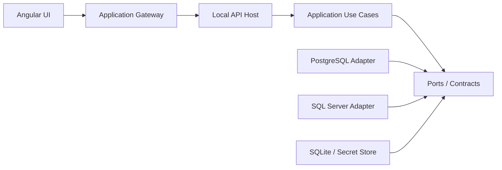

# Plan de trabajo — Druse

## 1. Objetivo del proyecto

Construir **Druse**, una aplicación de escritorio para administrar y consultar diferentes motores de bases de datos mediante una interfaz moderna y personalizable.

El primer producto funcional debe permitir:

- Crear y probar conexiones.
- Conectarse inicialmente a PostgreSQL y SQL Server.
- Explorar bases, esquemas, tablas, vistas, funciones, procedimientos y columnas.
- Escribir SQL con resaltado de sintaxis y autocompletado.
- Ejecutar una consulta completa o solamente el texto seleccionado.
- Cancelar una consulta en ejecución.
- Mostrar resultados, mensajes y errores.
- Exportar resultados a CSV y Excel.
- Consultar el historial de ejecución.
- Guardar conexiones y preferencias localmente de forma segura.
- Instalarse como aplicación de escritorio, comenzando por Windows y manteniendo compatibilidad de compilación con Linux y macOS.

MySQL se agregará cuando la arquitectura de proveedores esté validada con PostgreSQL y SQL Server.

---

## 2. Decisión tecnológica

### Stack principal

| Componente | Tecnología | Responsabilidad |
| --- | --- | --- |
| Interfaz | Angular | Ventanas, paneles, formularios y estado visual |
| Editor SQL | Monaco Editor | Edición, resaltado, selección y sugerencias SQL |
| API local | .NET | Conexiones, metadatos, ejecución y exportaciones |
| PostgreSQL | Npgsql | Proveedor PostgreSQL |
| SQL Server | Microsoft.Data.SqlClient | Proveedor SQL Server |
| MySQL | MySqlConnector | Proveedor MySQL futuro |
| Configuración local | SQLite | Conexiones, historial y preferencias no sensibles |
| Cuadrícula | AG Grid Community o equivalente | Visualización eficiente de resultados |
| Escritorio | Tauri | Empaquetado y distribución de Angular + .NET |
| Contrato UI/API | OpenAPI | Cliente Angular generado y transporte reemplazable |
| Pruebas backend | xUnit | Pruebas unitarias y de integración |
| Pruebas frontend | Vitest/Jasmine y Playwright | Pruebas de componentes y flujos principales |

### Decisión de implementación

Durante el desarrollo inicial se ejecutarán Angular y la API .NET como aplicaciones locales separadas. Tauri se incorporará después de completar el flujo vertical principal.

```text
Angular + Monaco Editor
          |
          | HTTP local con token temporal
          v
API .NET en 127.0.0.1
          |
          v
Proveedor PostgreSQL / SQL Server / MySQL
```

La API local debe escuchar exclusivamente en `127.0.0.1` y nunca exponerse en `0.0.0.0`.

### Arquitectura elegida: hexagonal modular

El proyecto utilizará **arquitectura hexagonal modular**, también conocida como Ports and Adapters, con reglas de Clean Architecture. El objetivo no es crear capas por apariencia, sino impedir que el núcleo dependa de Angular, ASP.NET, Tauri, SQLite, Npgsql, SqlClient o del sistema operativo.

Se mantendrá como un **monolito modular local**, no como microservicios. Separar procesos o desplegar servicios remotos no aporta valor al MVP y haría más difícil distribuir, depurar y utilizar la aplicación sin conexión.



Reglas obligatorias:

- `Domain` contiene conceptos puros y no referencia infraestructura.
- `Application` contiene casos de uso y depende solamente de `Domain` y contratos.
- `Database.Abstractions` define los contratos para motores, metadatos, sesiones y consultas.
- Los proveedores implementan los contratos y encapsulan totalmente su controlador y dialecto.
- Los proveedores se registran mediante inyección de dependencias. El MVP no cargará DLL desconocidas dinámicamente, pero los contratos quedarán listos para una futura arquitectura de plugins.
- `Host.LocalApi` solamente adapta HTTP hacia los casos de uso; no contiene reglas de negocio.
- Angular consume un `ApplicationGateway`; su implementación HTTP podrá reemplazarse por IPC sin modificar componentes.
- Tauri solamente administra ventana, ciclo de vida, actualizaciones y proceso auxiliar. No contiene lógica de base de datos.
- Toda dependencia apunta hacia el núcleo. Los proyectos internos nunca conocen proyectos externos.

### Requisito de portabilidad

La base de código debe poder compilar para:

- Windows x64 y ARM64.
- Linux x64 y ARM64.
- macOS x64 y Apple Silicon.

El primer instalador estable puede publicarse para Windows, pero ninguna decisión del núcleo debe impedir construir las otras plataformas.

Para lograrlo:

- Evitar llamadas directas al registro de Windows, DPAPI, rutas fijas o separadores `\\` fuera de adaptadores de plataforma.
- Publicar la API .NET como ejecutable autocontenido para cada Runtime Identifier.
- Utilizar rutas obtenidas mediante un servicio `IAppPaths`.
- Utilizar `ISecretStore` para abstraer Windows Credential Manager, macOS Keychain y Linux Secret Service.
- Utilizar `IFilePicker`, `IAppLifecycle` e `IPlatformInfo` para capacidades del sistema.
- Mantener SQLite y los documentos de usuario en el directorio de datos correspondiente a cada plataforma.
- Ejecutar compilación y pruebas en una matriz de Windows, Linux y macOS desde integración continua.
- No utilizar autenticación integrada de Windows como única forma de conexión a SQL Server.
- Versionar el contrato OpenAPI para desacoplar frontend y host.

La palabra *portable* se utilizará en dos sentidos:

1. **Portable entre sistemas operativos:** la misma base de código produce aplicaciones nativas por plataforma.
2. **Modo portable sin instalación:** distribución ZIP opcional que guarda configuración junto al ejecutable. Este modo no guardará contraseñas por defecto; posteriormente podrá ofrecer una bóveda cifrada con contraseña maestra.

---

## 3. Alcance del MVP

### Incluido

- Aplicación de escritorio inicialmente validada en Windows y preparada para Linux y macOS.
- Tema oscuro basado en el mockup, y tema claro derivado de él.
- Múltiples conexiones guardadas.
- PostgreSQL y SQL Server.
- Explorador jerárquico de objetos.
- Pestañas de consultas.
- Ejecución completa y por selección.
- Límite configurable de filas.
- Timeout y cancelación.
- Resultados tabulares.
- Mensajes y errores detallados.
- Exportación a CSV y Excel.
- Historial local.
- Credenciales cifradas.
- Confirmación para instrucciones destructivas.

### Fuera del MVP

- Diagramas entidad-relación.
- Comparación y sincronización de esquemas.
- Editor visual de tablas.
- Importaciones masivas.
- Túneles SSH.
- Sistema de plugins.
- Asistente de inteligencia artificial.
- Colaboración multiusuario.
- Sincronización en la nube.
- Aplicación móvil.

Estas funciones deben permanecer en el backlog para evitar que el primer lanzamiento crezca sin control.

---

## 4. Estructura inicial del repositorio

```text
druse/
├── PLAN_TRABAJO_DRUSE.md
├── README.md
├── .editorconfig
├── .gitignore
├── docs/
│   ├── architecture/
│   ├── decisions/
│   └── mockups/
│       └── druse-main.html
├── frontend/
│   └── src/app/
│       ├── core/
│       │   ├── application-gateway/
│       │   └── generated-api-client/
│       ├── shared/
│       ├── layout/
│       └── features/
│           ├── connections/
│           ├── database-explorer/
│           ├── query-editor/
│           ├── query-results/
│           ├── query-history/
│           └── settings/
├── backend/
│   ├── Druse.slnx
│   ├── src/
│   │   ├── Druse.Domain/
│   │   ├── Druse.Database.Abstractions/
│   │   ├── Druse.Application/
│   │   ├── Druse.Infrastructure/
│   │   ├── Druse.Persistence.Sqlite/
│   │   ├── Druse.Provider.PostgreSql/
│   │   ├── Druse.Provider.SqlServer/
│   │   ├── Druse.Provider.MySql/
│   │   ├── Druse.Platform.Abstractions/
│   │   ├── Druse.Platform.Native/
│   │   └── Druse.Host.LocalApi/
│   └── tests/
│       ├── Druse.UnitTests/
│       ├── Druse.ProviderContractTests/
│       └── Druse.IntegrationTests/
├── shells/
│   └── desktop-tauri/
└── build/
    ├── scripts/
    └── packaging/
```

No crear el proyecto MySQL hasta que PostgreSQL y SQL Server compartan correctamente las abstracciones comunes. _(Cumplido: se creó en la Fase 8, cuando las 24 pruebas contractuales ya pasaban idénticas en los dos primeros motores.)_

---

## 5. Diseño del backend

### Límites de los módulos

| Módulo | Puede conocer | No puede conocer |
| --- | --- | --- |
| `Domain` | Tipos y reglas del dominio | Drivers, HTTP, SQLite, Tauri, sistema operativo |
| `Database.Abstractions` | Contratos y modelos neutrales | Npgsql, SqlClient, MySqlConnector |
| `Application` | Domain y Abstractions | ASP.NET, Angular, Tauri, implementaciones concretas |
| Proveedores | Abstractions y su driver | Angular, Tauri, otros proveedores |
| `Infrastructure` | Application y adaptadores generales | Componentes de UI |
| `Platform.Native` | Platform.Abstractions y APIs nativas | Domain y reglas de consultas |
| `Host.LocalApi` | Application y composición de dependencias | Reglas de negocio nuevas |
| Angular | Contrato generado y modelos de presentación | Drivers y cadenas de conexión completas |
| Tauri | Ciclo de vida y capacidades nativas | Consultas SQL y reglas de ejecución |

### Entidades y modelos principales

- `ConnectionProfile`: nombre, motor, host, puerto, base, usuario y opciones.
- `DatabaseConnectionSession`: conexión abierta asociada a la aplicación.
- `DatabaseObject`: base, esquema, tabla, vista, función o procedimiento.
- `DatabaseColumn`: nombre, tipo, nulabilidad, clave y valor predeterminado.
- `QueryRequest`: conexión, SQL, selección, timeout y máximo de filas.
- `QueryExecution`: identificador y estado de una ejecución.
- `QueryResult`: conjuntos de resultados, mensajes, duración y filas afectadas.
- `ResultSet`: columnas y filas devueltas.
- `QueryHistoryEntry`: consulta, conexión, fecha, duración y resultado.

### Abstracciones necesarias

```csharp
public interface IDatabaseProvider
{
    DatabaseEngine Engine { get; }

    Task<TestConnectionResult> TestConnectionAsync(
        ConnectionProfile profile,
        CancellationToken cancellationToken);

    Task<IDatabaseSession> OpenSessionAsync(
        ConnectionProfile profile,
        CancellationToken cancellationToken);
}

public interface IDatabaseMetadataReader
{
    Task<IReadOnlyList<DatabaseObject>> GetDatabasesAsync(
        IDatabaseSession session,
        CancellationToken cancellationToken);

    Task<IReadOnlyList<DatabaseObject>> GetChildrenAsync(
        IDatabaseSession session,
        DatabaseObject parent,
        CancellationToken cancellationToken);
}

public interface IQueryExecutor
{
    Task<QueryResult> ExecuteAsync(
        IDatabaseSession session,
        QueryRequest request,
        CancellationToken cancellationToken);
}
```

Cada proveedor implementará consultas de metadatos propias. No se debe forzar una sola consulta para todos los motores porque sus catálogos y dialectos son diferentes.

### Reglas de ejecución

- Ejecutar SQL arbitrario mediante `DbCommand` y `DbDataReader`.
- No utilizar Entity Framework para ejecutar las consultas escritas por el usuario.
- Dapper puede utilizarse únicamente para SQLite y almacenamiento interno si aporta simplicidad.
- Aplicar `CancellationToken` desde el endpoint hasta el controlador del motor.
- Configurar un máximo inicial de 500 filas, modificable por el usuario.
- No agregar automáticamente `LIMIT` o `TOP` al SQL sin entender el dialecto.
- Leer resultados progresivamente y evitar cargar volúmenes ilimitados en memoria.
- Soportar varios conjuntos de resultados cuando el controlador lo permita.
- Conservar mensajes, filas afectadas, duración y excepciones normalizadas.

---

## 6. Diseño del frontend

### Módulos principales

#### `layout`

- Barra superior.
- Barra lateral de conexiones.
- Área de pestañas.
- Panel inferior.
- Barra de estado.

#### `connections`

- Modal para crear y editar conexiones.
- Prueba de conexión.
- Selector de motor.
- Indicador de estado.
- Colores para diferenciar producción, pruebas y desarrollo.

#### `database-explorer`

- Árbol con carga perezosa.
- Actualización por nodo.
- Menú contextual.
- Apertura de consultas desde tabla o vista.
- Acciones futuras para generar SQL.

#### `query-editor`

- Integración con Monaco Editor.
- Pestañas independientes.
- Ejecución completa y por selección.
- Atajos de teclado.
- Formateo.
- Estado modificado/no guardado.
- Autocompletado inicial con palabras reservadas.
- Autocompletado posterior con esquemas, tablas y columnas.

#### `query-results`

- Una pestaña por conjunto de resultados.
- Encabezados con nombre y tipo.
- Filtros locales básicos.
- Copiar celdas y filas.
- Exportación.
- Duración y filas afectadas.
- Vista separada para mensajes y errores.

### Estado de la aplicación

Para el MVP utilizar servicios Angular, Signals y RxJS. No incorporar NgRx hasta que exista una necesidad comprobada de estado global más complejo.

Estados que deben manejarse explícitamente:

- Conexiones guardadas.
- Sesiones abiertas.
- Nodo seleccionado en el explorador.
- Pestañas abiertas.
- Texto y selección de cada editor.
- Consulta activa y posibilidad de cancelación.
- Resultados asociados a cada pestaña.
- Configuración visual.

---

## 7. API local propuesta

| Método | Ruta | Finalidad |
| --- | --- | --- |
| `GET` | `/api/health` | Verificar que el proceso local está activo |
| `GET` | `/api/engines` | Listar motores disponibles |
| `GET` | `/api/connections` | Listar perfiles guardados |
| `POST` | `/api/connections` | Crear un perfil |
| `PUT` | `/api/connections/{id}` | Actualizar un perfil |
| `DELETE` | `/api/connections/{id}` | Eliminar un perfil |
| `POST` | `/api/connections/test` | Probar credenciales sin guardarlas |
| `POST` | `/api/sessions` | Abrir una sesión |
| `DELETE` | `/api/sessions/{id}` | Cerrar una sesión |
| `GET` | `/api/sessions/{id}/metadata/databases` | Obtener bases disponibles |
| `GET` | `/api/sessions/{id}/metadata/children` | Obtener hijos de un nodo |
| `POST` | `/api/queries` | Iniciar una ejecución |
| `DELETE` | `/api/queries/{executionId}` | Cancelar una ejecución |
| `GET` | `/api/history` | Consultar historial |
| `POST` | `/api/exports/csv` | Exportar resultados a CSV |
| `POST` | `/api/exports/xlsx` | Exportar resultados a Excel |

Los DTO no deben exponer contraseñas en respuestas, logs o mensajes de error.

---

## 8. Plan por fases

## Fase 0 — Preparación y decisiones

### Tareas

- [x] Crear el repositorio Git.
- [x] Copiar el mockup a `docs/mockups/druse-main.html`. _(HTML en vez de PNG: es la fuente de verdad; ver bitácora D-03.)_
- [x] Crear la solución .NET y el proyecto Angular.
- [x] Agregar `.editorconfig`, `.gitignore` y convenciones de nombres.
- [x] Documentar las decisiones principales en `docs/decisions`.
- [x] Crear ADR de arquitectura hexagonal, transporte local y estrategia multiplataforma.
- [x] Configurar reglas automáticas para impedir dependencias inválidas entre proyectos.
- [x] Definir la paleta, tipografías, espaciados e iconos a partir del mockup.
- [x] Configurar compilación y pruebas en Windows, Linux y macOS.

### Criterio de salida

La solución compila, Angular inicia, la API responde en `/api/health` y existe un único comando documentado para ejecutar ambos proyectos en desarrollo.

## Fase 1 — Shell visual basado en el mockup

### Tareas

- [x] Crear el layout general.
- [x] Implementar barra superior y barra de estado.
- [x] Crear panel redimensionable de conexiones.
- [x] Crear sistema de pestañas.
- [x] Integrar Monaco Editor con datos simulados.
- [x] Crear panel redimensionable de resultados.
- [x] Implementar tema oscuro y variables de diseño.
- [x] Añadir tema claro sobre las mismas variables, con conmutador en la barra superior.
- [x] Panel de preferencias: acento, tono de la interfaz, tamaño y fondo del editor.
- [x] Crear la cuadrícula con datos simulados.

### Criterio de salida

La pantalla reproduce el mockup con proporciones, colores y comportamiento de paneles consistente, todavía sin conexión real.

## Fase 2 — Flujo vertical PostgreSQL

### Tareas

- [x] Implementar `IDatabaseProvider`.
- [x] Crear `PostgreSqlDatabaseProvider` con Npgsql.
- [x] Crear y probar una conexión PostgreSQL.
- [x] Abrir y cerrar sesiones.
- [x] Obtener bases, esquemas, tablas, vistas y columnas.
- [x] Mostrar los metadatos con carga perezosa en el árbol.
- [x] Ejecutar una consulta desde Monaco.
- [x] Mostrar columnas, tipos, filas, duración y mensajes.
- [x] Ejecutar solamente el texto seleccionado.
- [x] Cancelar consultas.
- [x] Limitar filas y configurar timeout. _(timeout fijo en 30 s; hacerlo configurable en la interfaz queda para la Fase 5.)_

### Criterio de salida

Un usuario puede conectarse a PostgreSQL, navegar hasta una tabla, ejecutar un `SELECT`, ver el resultado y cancelar una consulta larga.

## Fase 3 — Persistencia local y seguridad

### Tareas

- [x] Crear la base SQLite local.
- [x] Guardar perfiles sin incluir la contraseña en texto plano.
- [x] Integrar el almacén seguro del sistema operativo para secretos.
- [x] Guardar historial de consultas.
- [x] Guardar pestañas recientes y preferencias. _(preferencias sí; recordar las pestañas abiertas queda para la Fase 5, junto al resto del estado del editor.)_
- [x] Implementar perfiles de color para producción, pruebas y desarrollo.
- [x] Ocultar información sensible de logs y excepciones.
- [x] Agregar token temporal entre Angular y la API local.
- [x] Restringir CORS al origen de la aplicación.
- [x] Implementar `IAppPaths` e `ISecretStore` sin dependencias del sistema operativo en Application.

### Criterio de salida

Cerrar y abrir la aplicación conserva conexiones, historial y preferencias sin almacenar contraseñas legibles.

## Fase 4 — SQL Server

### Tareas

- [x] Crear `SqlServerDatabaseProvider`.
- [x] Implementar autenticación SQL Server.
- [x] Evaluar autenticación integrada de Windows como tarea separada. _(Evaluada y descartada del MVP: ata la aplicación a Windows. Queda en el backlog de prioridad alta, como dice el plan §15.)_
- [x] Obtener bases, esquemas, tablas, vistas, procedimientos y columnas.
- [x] Ejecutar consultas T-SQL.
- [x] Normalizar mensajes y errores.
- [x] Probar múltiples conjuntos de resultados.
- [x] Verificar timeout y cancelación.
- [x] Ejecutar las pruebas contractuales compartidas por proveedores.

### Criterio de salida

Las mismas funciones visibles del MVP trabajan con PostgreSQL y SQL Server sin condicionales del motor dentro de los componentes Angular.

## Fase 5 — Productividad del editor

### Tareas

- [x] Atajos para ejecutar, cancelar, guardar y crear consulta.
- [x] Formateador SQL consciente del dialecto.
- [x] Sugerencias de palabras reservadas.
- [x] Sugerencias de esquemas, tablas y columnas cargadas.
- [x] Generar `SELECT` desde una tabla.
- [x] Copiar nombre completo del objeto.
- [x] Abrir varias pestañas.
- [x] Indicador de cambios sin guardar.
- [x] Búsqueda en el editor. _(la de Monaco, con Ctrl+F.)_
- [x] Historial filtrable.

### Criterio de salida

El flujo cotidiano de abrir conexión, localizar tabla, escribir, ejecutar y reutilizar una consulta puede completarse únicamente con teclado y pocos clics.

## Fase 6 — Resultados y exportaciones

### Tareas

- [x] Soportar varios conjuntos de resultados.
- [x] Copiar celdas, filas y encabezados.
- [x] Exportar CSV con codificación configurable.
- [x] Exportar XLSX.
- [x] Mostrar valores `NULL` de manera diferenciada.
- [x] Renderizar fechas, booleanos, números y binarios correctamente.
- [x] Manejar resultados grandes sin congelar la interfaz. _(el límite de 500 filas mantiene fluida la cuadrícula; exportar recorre el resultado completo sin materializarlo.)_
- [x] Mostrar filas afectadas para `INSERT`, `UPDATE` y `DELETE`.
- [x] Agregar advertencias para operaciones destructivas.

### Criterio de salida

Los resultados pueden inspeccionarse y exportarse de manera confiable sin bloquear la interfaz ni perder tipos básicos.

## Fase 7 — Empaquetado de escritorio

### Tareas

- [x] Inicializar Tauri sobre el frontend existente.
- [x] Publicar la API .NET como ejecutable autocontenido.
- [x] Publicar ejecutables por Runtime Identifier y arquitectura. _(la publicación acepta cualquier RID con `-Runtime`; solo se ha ejecutado win-x64.)_
- [x] Incluir la API como proceso auxiliar reemplazable de la aplicación.
- [x] Elegir un puerto local dinámico o comunicación IPC segura.
- [x] Finalizar correctamente la API al cerrar la aplicación.
- [x] Crear icono, nombre, versión y metadatos del instalador.
- [x] Generar instalador para Windows x64.
- [ ] Generar artefactos de prueba para Linux x64 y macOS ARM64. _(el trabajo está hecho en integración continua —un job por plataforma que empaqueta y deja el `.deb`, el `.AppImage` y el `.dmg` descargables—; queda marcarlo cuando esa ejecución termine en verde.)_
- [x] Crear distribución ZIP en modo portable para Windows.
- [x] Validar instalación, actualización y desinstalación. _(hecho en la sesión 021 sobre este equipo: instala sin permisos de administrador, actualizar deja una sola entrada en el registro y conserva `druse.db`, y desinstalar no deja restos ni toca los datos del usuario. Destapó que la API auxiliar sobrevivía a un cierre forzado; corregido.)_
- [ ] Probar en un equipo sin SDK de .NET ni Node.js. _(pendiente: hace falta un equipo limpio.)_

### Criterio de salida

Druse se instala y ejecuta en Windows sin que el usuario tenga que instalar Node.js, Angular CLI o el SDK de .NET.

## Fase 8 — MySQL y estabilización

### Tareas

- [x] Crear `MySqlDatabaseProvider`.
- [x] Implementar metadatos MySQL/MariaDB. _(verificado también contra MariaDB 11.4, que supera las mismas 24 pruebas.)_
- [x] Ejecutar las pruebas contractuales de proveedores. _(24 × 3 motores = 72, sin cambiar ninguna comprobación.)_
- [x] Corregir diferencias de tipos y mensajes.
- [x] Crear pruebas de regresión para los tres motores.
- [x] Medir consumo de memoria y tiempos de respuesta.
- [x] Preparar la primera versión beta. _(ver `docs/release-notes/0.1.0-beta.md`.)_

### Criterio de salida

Los tres motores superan el mismo contrato sin excepciones y existe una versión
instalable con sus notas y sus límites declarados.

---

## 9. Orden recomendado para comenzar

Realizar estas tareas exactamente en este orden:

1. Crear el repositorio y guardar el mockup en `docs/mockups`.
2. Crear la solución .NET y una API mínima con `/api/health`.
3. Crear Angular y reproducir solamente la estructura principal del mockup.
4. Integrar Monaco Editor y la cuadrícula con datos simulados.
5. Definir las interfaces de proveedores y los modelos comunes.
6. Implementar prueba de conexión PostgreSQL.
7. Implementar exploración de metadatos PostgreSQL.
8. Ejecutar un `SELECT` real y mostrarlo en la cuadrícula.
9. Implementar cancelación, timeout y límite de filas.
10. Guardar perfiles e historial localmente.
11. Implementar SQL Server utilizando las mismas interfaces.
12. Empaquetar con Tauri después de estabilizar ambos motores.

La primera integración real debe ser una rebanada vertical completa. No construir todos los formularios ni todos los proveedores antes de ejecutar la primera consulta real.

---

## 10. Primeros comandos sugeridos

```bash
mkdir druse
cd druse
git init

mkdir -p backend/src backend/tests docs/mockups docs/architecture docs/decisions

dotnet new sln -n Druse -o backend   # en .NET 10 genera Druse.slnx
dotnet new classlib -n Druse.Domain -o backend/src/Druse.Domain
dotnet new classlib -n Druse.Database.Abstractions -o backend/src/Druse.Database.Abstractions
dotnet new classlib -n Druse.Application -o backend/src/Druse.Application
dotnet new classlib -n Druse.Infrastructure -o backend/src/Druse.Infrastructure
dotnet new classlib -n Druse.Persistence.Sqlite -o backend/src/Druse.Persistence.Sqlite
dotnet new classlib -n Druse.Provider.PostgreSql -o backend/src/Druse.Provider.PostgreSql
dotnet new classlib -n Druse.Provider.SqlServer -o backend/src/Druse.Provider.SqlServer
dotnet new classlib -n Druse.Platform.Abstractions -o backend/src/Druse.Platform.Abstractions
dotnet new classlib -n Druse.Platform.Native -o backend/src/Druse.Platform.Native
dotnet new webapi -n Druse.Host.LocalApi -o backend/src/Druse.Host.LocalApi
dotnet new xunit -n Druse.UnitTests -o backend/tests/Druse.UnitTests
dotnet new xunit -n Druse.ProviderContractTests -o backend/tests/Druse.ProviderContractTests
dotnet new xunit -n Druse.IntegrationTests -o backend/tests/Druse.IntegrationTests

npx @angular/cli@latest new frontend --routing --style=scss --ssr=false
```

Después de generar los proyectos, agregarlos a la solución y configurar las referencias respetando esta dirección:

```text
Host.LocalApi -> Application
Host.LocalApi -> Infrastructure
Host.LocalApi -> Provider.PostgreSql
Host.LocalApi -> Provider.SqlServer
Host.LocalApi -> Provider.MySql
Host.LocalApi -> Persistence.Sqlite
Host.LocalApi -> Platform.Native
Application -> Domain
Application -> Database.Abstractions
Application -> Platform.Abstractions
Infrastructure -> Application
Persistence.Sqlite -> Application
Platform.Native -> Platform.Abstractions
Provider.PostgreSql -> Database.Abstractions
Provider.SqlServer -> Database.Abstractions
Provider.MySql -> Database.Abstractions
```

`Domain`, `Database.Abstractions` y `Platform.Abstractions` no deben depender de infraestructura concreta. La composición de implementaciones ocurre únicamente en `Host.LocalApi`.

---

## 11. Estrategia de pruebas

### Pruebas unitarias

- Validación de perfiles de conexión.
- Normalización de errores.
- Selección del proveedor correcto.
- Conversión de columnas y valores.
- Reglas de timeout y máximo de filas.
- Detección preventiva de instrucciones destructivas.

### Pruebas contractuales de proveedores

Todos los proveedores deben ejecutar el mismo conjunto de pruebas:

- Conexión válida e inválida.
- Lectura de esquemas.
- Lectura de tablas y columnas.
- `SELECT` sin filas.
- `SELECT` con valores nulos.
- Varios tipos de datos.
- Consulta con error sintáctico.
- Timeout.
- Cancelación.
- Varias consultas o conjuntos de resultados.

### Pruebas de integración

Utilizar contenedores desechables de PostgreSQL y SQL Server cuando sea posible. Las pruebas no deben depender de servidores personales ni credenciales guardadas en el repositorio.

### Pruebas de interfaz

- Crear conexión.
- Probar conexión.
- Expandir esquema y tabla.
- Abrir consulta.
- Ejecutar selección.
- Cancelar ejecución.
- Exportar resultados.
- Recuperar historial.

---

## 12. Seguridad desde el inicio

- Nunca guardar contraseñas en `appsettings.json`, SQLite, archivos JSON o Git.
- Nunca devolver contraseñas al frontend después de guardarlas.
- Nunca registrar cadenas de conexión completas.
- Utilizar el almacén seguro del sistema operativo para secretos.
- Identificar claramente conexiones de producción.
- Permitir marcar conexiones como solo lectura.
- Solicitar confirmación antes de `DROP`, `TRUNCATE` o `DELETE` sin filtro.
- Configurar timeout por defecto.
- Permitir cancelar cualquier ejecución activa.
- Usar un identificador impredecible para cada sesión local.
- Cerrar conexiones y transacciones al finalizar la aplicación.
- No exponer la API local a la red.

La detección de SQL destructivo es una ayuda visual y no sustituye los permisos reales configurados en el servidor de base de datos.

---

## 13. Convenciones de trabajo

- Una rama por funcionalidad.
- Commits pequeños y descriptivos.
- No mezclar cambios visuales grandes con cambios del motor de ejecución.
- Agregar pruebas para cada comportamiento importante del backend.
- Mantener consultas específicas dentro de cada proveedor.
- No poner condiciones como `if PostgreSQL` o `if SQL Server` dentro del frontend.
- Actualizar este documento al cerrar cada fase.
- Registrar decisiones técnicas importantes en `docs/decisions`.
- Evitar nuevas dependencias sin documentar su propósito.

Ejemplos de ramas:

```text
feature/app-shell
feature/postgresql-connection
feature/database-explorer
feature/query-execution
feature/sqlserver-provider
feature/desktop-packaging
```

---

## 14. Definición de terminado del MVP

El MVP estará terminado cuando:

- [x] Existe un instalador funcional para Windows. _(NSIS, MSI y ZIP portable; falta validar el ciclo de instalación en otro equipo.)_
- [x] La solución compila y ejecuta pruebas automatizadas en Windows, Linux y macOS. _(matriz de integración continua.)_
- [x] La API puede publicarse de forma autocontenida para diferentes Runtime Identifiers.
- [x] La interfaz conserva el diseño principal del mockup. _(comparado a ojo con el mockup en la sesión 011; la única zona ausente es «Plan de ejecución», que está fuera del MVP.)_
- [x] PostgreSQL y SQL Server funcionan mediante proveedores independientes. _(y MySQL/MariaDB desde la Fase 8.)_
- [x] Las conexiones se guardan de forma segura.
- [x] El explorador carga objetos bajo demanda.
- [x] El editor ejecuta todo el SQL o la selección activa.
- [x] Las consultas pueden cancelarse.
- [x] Los resultados no congelan la interfaz con el límite configurado.
- [x] Los mensajes y errores son comprensibles.
- [x] Los resultados se exportan a CSV y XLSX.
- [x] El historial persiste después de reiniciar.
- [x] Las pruebas unitarias y de integración principales pasan.
- [ ] La aplicación funciona en un equipo limpio. _(pendiente: hace falta otra máquina sin .NET ni Node.)_
- [x] No existen dependencias del sistema operativo fuera de adaptadores de plataforma.
- [x] Agregar un nuevo proveedor no exige modificar Domain, Application ni los componentes Angular. _(demostrado con MySQL: tres líneas en la composición y ni un componente Angular tocado.)_

---

## 15. Backlog posterior al MVP

### Pedido por el usuario tras probar la beta (sesión 011) — hecho

Las tres estaban en el backlog, sueltas y descritas por su etiqueta. El usuario
las pidió juntas después de usar la beta contra su base de preproducción, y se
entregaron en ese mismo orden porque todas tocan la pieza que el MVP dejó de
solo lectura:

| # | Petición | Cómo quedó |
| --- | --- | --- |
| 1 | **Ajustar varios registros a la vez** | Edición en la cuadrícula, solo donde se puede señalar una fila sin ambigüedad: tabla abierta desde el explorador, con clave primaria, y con esa clave entre las columnas. Guardar es en dos pasos, con el `UPDATE` a la vista. En el servidor: transacción, parámetros y **una fila por instrucción**. |
| 2 | **Exportar e importar, fácil** | Importar CSV y XLSX desde la tabla. Las columnas se emparejan **por nombre, nunca por posición**; la previsualización revisa todas las filas y enumera lo que no cabe con su fila y su columna; si hay un solo valor imposible, no entra nada. |
| 3 | **Ayuda para crear las consultas** | Panel que compone `SELECT` con columnas, filtros, orden y límite, enseñando el SQL mientras se hace; más plantillas de `INSERT`, `UPDATE` y `CREATE TABLE` desde el catálogo. Una sola tabla: el JOIN necesita saber por qué columnas se relacionan, y eso aún no se lee. |

**Lo que salió de usarla y no estaba previsto:** el explorador no podía listar
tablas sin permisos de administración, el autocompletado se apagaba con esquemas
propios, dos peticiones simultáneas rompían la conexión y los errores del motor
llegaban como «error inesperado». Los cuatro corregidos.

### Mejora solicitada para el explorador y la composición SQL — completada

**Estado al 13 de agosto de 2026:** las tres entregas están implementadas y
verificadas automática y manualmente.

El siguiente incremento mejorará el trabajo desde el explorador sin ejecutar
cambios automáticamente en la base de datos:

- Mostrar el tipo de dato junto a cada columna de una tabla o vista.
- Generar plantillas de `SELECT`, `INSERT`, `UPDATE` y `DROP TABLE` respetando el
  dialecto de PostgreSQL, SQL Server y MySQL/MariaDB.
- Obtener del motor y mostrar el DDL con el que se crea una vista.

#### Entrega 1 — Tipos de datos en las columnas

El backend y el modelo del frontend ya reciben `DatabaseColumn.DataType`. El
trabajo pendiente es conservar ese valor al convertir las columnas en nodos del
explorador y presentarlo como información secundaria, sin añadir otra consulta de
metadatos.

Tareas:

- [x] Rellenar `ExplorerNode.hint` con `DatabaseColumn.dataType` al construir los
  nodos de columna en `frontend/src/app/core/workspace/workspace-store.ts`.
- [x] Renderizar el tipo al lado del nombre en
  `frontend/src/app/features/connections/connections-sidebar/connections-sidebar.html`.
- [x] Ajustar el truncado y la distribución en
  `connections-sidebar.scss` para nombres y tipos largos.
- [x] Probar que una columna cargada conserva y muestra su tipo completo, incluidos
  longitud, precisión y escala cuando el proveedor los devuelve.

Criterio de salida: al expandir una tabla o vista se ve, por ejemplo,
`total numeric(12,2)` o `name varchar(200)`, sin afectar la carga perezosa del
árbol.

#### Entrega 2 — Plantillas SQL desde tablas

El compositor ya genera `SELECT`, `INSERT` y `UPDATE` mediante el escritor SQL
común. Se reutilizará ese flujo y se añadirá `DROP TABLE`; no se generará SQL
concatenando identificadores desde los componentes visuales.

Regla obligatoria: las plantillas dependen del motor de la conexión desde la que
se abrió la tabla. No existirá una plantilla SQL genérica reutilizada sin adaptar.
El generador debe recibir el `DatabaseEngine` resuelto mediante
`ExplorerNode.connectionId` y aplicar el dialecto correspondiente:

- PostgreSQL: identificadores con comillas dobles y límites mediante `LIMIT`.
- SQL Server: identificadores entre corchetes y límites mediante `TOP`.
- MySQL/MariaDB: identificadores entre acentos graves y límites mediante `LIMIT`.

Las diferencias futuras de sintaxis para valores generados, retornos, conflictos,
actualizaciones o borrados deben permanecer encapsuladas en el escritor SQL por
motor, nunca repartidas como condiciones dentro de los componentes Angular.

Tareas:

- [x] Añadir `buildDropTable` en
  `frontend/src/app/features/query-editor/sql-language/sql-writer.ts`.
- [x] Añadir la acción `DROP TABLE` al compositor únicamente para nodos de tabla.
- [x] Mantener `INSERT`, `UPDATE`, `CREATE TABLE` y `DROP TABLE` fuera de las
  acciones de vistas, porque no se conoce si una vista es actualizable.
- [x] Reutilizar `buildSelect` en el SELECT rápido del explorador para citar
  identificadores y generar `TOP 100` en SQL Server en vez de `LIMIT 100`.
- [x] Abrir cada plantilla en una pestaña del editor para que el usuario pueda
  revisarla y modificarla antes de ejecutarla.
- [x] Resolver el `DatabaseEngine` desde la conexión del nodo que originó la
  acción, incluso cuando haya varias conexiones de motores distintos abiertas.
- [x] Cubrir PostgreSQL (`"objeto"`), SQL Server (`[objeto]`) y MySQL/MariaDB
  (`` `objeto` ``) con pruebas del escritor SQL.

La acción solo compone texto. Si el usuario ejecuta un `DROP`, seguirá pasando por
la detección y confirmación de instrucciones destructivas que ya existe.

Criterio de salida: desde cualquier tabla pueden abrirse plantillas válidas para
el motor de su propia conexión de `SELECT`, `INSERT`, `UPDATE` y `DROP TABLE`;
las acciones de escritura no aparecen en vistas. Con conexiones simultáneas a
motores distintos, cada tabla genera exclusivamente la sintaxis de su motor.

#### Entrega 3 — DDL de vistas

La definición debe obtenerse del catálogo de cada motor, no reconstruirse a partir
de las columnas. Se añadirá una operación de lectura de metadatos que atraviese el
contrato de proveedores, la aplicación, la API local y el `ApplicationGateway`.
El resultado se abrirá en una pestaña del editor existente.

La conexión también enumera todas las bases a las que el usuario tiene acceso.
Cada nodo, pestaña, consulta, exportación, edición e importación conserva la base
seleccionada; PostgreSQL y SQL Server abren una conexión auxiliar temporal porque
sus catálogos dependen de la base activa. MySQL/MariaDB mantiene su navegación
calificada por esquema.

El compositor permite rellenar `INSERT` y `UPDATE` por columna, distinguiendo
valor, cadena vacía, `NULL`, omisión y `DEFAULT`. El `UPDATE` conserva una sección
`WHERE` obligatoria y el SQL resultante siempre queda visible y editable antes de
abrirse en el editor.

Los `SELECT` pueden añadir varios cruces manuales con tablas de la misma base:
`INNER`, `LEFT`, `RIGHT`, `FULL OUTER` y `CROSS JOIN`. MySQL/MariaDB no ofrece
`FULL OUTER JOIN` porque el motor no lo soporta; los resultados con cruces no se
marcan como editables para evitar atribuir a la tabla principal columnas ajenas.
El selector de cada cruce busca por `esquema.tabla` y carga bajo demanda el
esquema escrito, para no obligar a recorrer catálogos grandes. Las sugerencias
admiten búsqueda parcial, flechas, `Enter` y `Escape`, con un máximo visible para
mantener fluida la lista en catálogos grandes.

Tareas de backend:

- [x] Añadir una operación de definición de vista a
  `IDatabaseMetadataReader` y a `MetadataService`, respetando el turno exclusivo
  de la sesión.
- [x] Implementarla en PostgreSQL con `pg_get_viewdef`, distinguiendo vistas
  normales y materializadas.
- [x] Implementarla en SQL Server con `sys.views` y `sys.sql_modules`, devolviendo
  un error comprensible cuando la definición sea privada o esté cifrada.
- [x] Implementarla en MySQL/MariaDB con `SHOW CREATE VIEW`, conservando las
  cláusulas que entregue el motor.
- [x] Exponer `POST /api/sessions/{sessionId}/metadata/definition` con una respuesta
  pequeña de la forma `{ sql }`.
- [x] Añadir pruebas contractuales para los tres proveedores y una prueba de
  integración del endpoint.

Tareas de frontend:

- [x] Añadir la operación al `ApplicationGateway` y a su implementación HTTP.
- [x] Mostrar la acción «Ver DDL» únicamente en nodos de vista.
- [x] Resolver la sesión y el motor desde `ExplorerNode.connectionId`, no desde la
  primera conexión activa.
- [x] Solicitar la definición y abrirla en una pestaña SQL editable.
- [x] Mostrar errores de permisos o definiciones no disponibles sin cerrar la
  sesión ni alterar el árbol.

Criterio de salida: una vista de cualquiera de los tres motores soportados puede
abrirse como DDL en el editor y el texto contiene una instrucción de creación y la
consulta que define la vista.

#### Trabajo técnico asociado

Antes de considerar completa la mejora con varias conexiones abiertas, se debe
evitar que dos relaciones con el mismo nombre compartan metadatos accidentalmente:

- [x] Cambiar la clave de la caché de columnas para incluir conexión, base,
  esquema y relación.
- [x] Hacer que las acciones iniciadas en el explorador resuelvan siempre su
  contexto mediante `connectionId`.
- [x] Verificar el alcance entre bases de una sesión, especialmente en SQL Server,
  antes de ofrecer DDL para objetos de una base distinta a la conectada.

No forma parte de este incremento reconstruir el DDL completo de tablas, detectar
relaciones para generar `JOIN`, ejecutar `DROP` directamente desde el árbol ni
determinar si una vista admite escrituras.

#### Verificación final

- [x] Ejecutar las pruebas unitarias y la compilación del frontend.
- [x] Compilar y ejecutar las pruebas del backend.
- [x] Ejecutar las pruebas contractuales reales contra PostgreSQL, SQL Server y
  MySQL/MariaDB.
- [x] Comprobar manualmente nombres con espacios, palabras reservadas, tipos largos
  y dos conexiones abiertas con esquemas y tablas del mismo nombre.

### Incremento de interfaz y navegación — implementado

- [x] Mostrar conexión, base, motor y entorno en las pestañas del editor.
- [x] Sustituir las acciones ambiguas del explorador por un menú textual accesible.
- [x] Añadir una paleta global `Ctrl+K` para comandos, conexiones, tablas y vistas.
- [x] Mejorar resultados con densidad configurable, encabezados fijos, estados
  vacíos, errores copiables y aviso de resultados recortados.
- [x] Añadir navegación de pestañas por teclado y explorador móvil en un drawer.
- [x] Aislar resultados y avisos asíncronos por pestaña, conexión y texto SQL.
- [x] Cubrir los flujos nuevos con 168 pruebas frontend y compilación de producción.
- [x] Mantener el bundle inicial dentro del presupuesto de 500 kB cargando la
  paleta de comandos de forma diferida.
- [x] Completar una pasada visual manual en escritorio y móvil con el stack local.
- [x] Marcar en Monaco la línea reportada por PostgreSQL o SQL Server, incluida
  la posición correcta cuando se ejecuta solo una selección.
- [x] Mostrar «Ver DDL» en procedimientos almacenados y resolver sobrecargas de
  PostgreSQL sin confundir procedimientos homónimos.
- [x] Cubrir el incremento final con 295 pruebas backend y 176 frontend.

### Transacciones manuales — implementadas

Commit y Rollback eran botones muertos heredados del mockup. Ahora gobiernan una
transacción de verdad, con tres decisiones que condicionan el resto:

- [x] **La transacción se ata a la conexión, no a la pestaña.** No es una
  preferencia: varias pestañas del mismo perfil comparten conexión, así que lo
  que se ejecute en cualquiera de ellas entra en la misma transacción. El
  indicador dice a qué conexión afecta justamente por eso.
- [x] **Al modo manual se entra a propósito**, con «Iniciar transacción».
  El autocommit sigue siendo lo normal, y Commit y Rollback solo aparecen cuando
  hay una abierta.
- [x] **Se deshace sola tras 15 minutos sin actividad.** Una transacción olvidada
  mantiene filas bloqueadas para todos; el barrido corre en el proceso local y no
  en el navegador, porque la ventana puede estar cerrada justo cuando hay que
  soltar los bloqueos. Lo que se mide es la inactividad, no la duración.
- [x] `SessionTransaction` sostiene la transacción entre peticiones con las reglas
  en un solo sitio; `OperationScope` decide si el editor de filas y el diseñador
  abren la suya o se unen a la del usuario, porque anidarlas revienta en estos
  motores.
- [x] Consultas, catálogo, exportación, edición de filas y DDL van dentro de la
  transacción cuando hay una abierta. Sin esto, SQL Server rechaza hasta expandir
  un nodo del árbol.
- [x] Avisos donde el usuario los necesita: al cerrar una conexión con cambios sin
  confirmar, al cerrar la ventana, y en el propio indicador cuando el motor no
  deshace el DDL.
- [x] Cubierto con 10 pruebas de backend sobre una base real en memoria —lo escrito
  dentro desaparece al deshacer— y 13 de frontend.

**Lo que no se hace, y es una decisión:** si una operación falla a medias dentro
de una transacción del usuario, no se deshace sola. Exigiría un punto de guardado,
y tirar de la transacción entera borraría trabajo que nadie pidió borrar; los
mensajes lo dicen en lugar de afirmar que no se guardó nada.

### Ejecutar procedimientos sin escribir la llamada — implementado

Pedido por el usuario: un procedimiento solo ofrecía «Ver DDL», así que llamarlo
exigía leer su definición, entender la firma y escribir el `EXEC` a mano.

- [x] Leer los parámetros del catálogo —nombre, tipo, dirección y si tienen valor
  por omisión— en los cuatro motores, con `RoutineSignature` atravesando el
  contrato de proveedores, la aplicación, la API local y el gateway.
- [x] Formulario con un campo por parámetro que distingue **valor, `NULL` y
  omitir**: omitir deja que el motor ponga el suyo y `NULL` es decirle que no hay
  valor, y confundirlos es de los errores más caros al llamar a algo ajeno.
- [x] Parámetros de salida y valor de retorno desde el principio: la llamada
  declara la variable, la pasa y la lee después.
- [x] El SQL queda a la vista y **editable** antes de ejecutar, como en el resto
  de Druse; ejecutar abre además la pestaña para que quede escrito qué se lanzó.

Cada motor escribe la llamada a su manera y eso vive en el escritor SQL, no
repartido por los componentes: `EXEC … OUTPUT` en SQL Server, variables de sesión
en MySQL, `CALL` con huecos `NULL` en PostgreSQL —que devuelve las salidas como
resultado— y `EXECUTE PROCEDURE` en Informix.

**Lo que no se hace, y es una decisión:** Informix no recoge parámetros de salida
fuera de un procedimiento —el `INTO` solo existe dentro de SPL—, así que allí la
llamada se ejecuta sin ellos y se avisa por escrito en lugar de generar algo que
el motor rechazaría. Las funciones tampoco entran: se llaman dentro de una
consulta y no encajan en un formulario de ejecución.

### Recuperar el trabajo sin ejecutar — implementado

Pedido por el usuario. Cerrar la aplicación o el navegador se llevaba lo escrito
y no ejecutado: el historial solo guarda lo que llegó a lanzarse. Cierra además
la deuda que la Fase 3 dejó anotada («recordar las pestañas abiertas»).

- [x] Guardar las pestañas —SQL, título, orden, cuál está activa, su conexión y
  su base— en el SQLite del usuario, junto a las preferencias y el historial.
- [x] Guardado automático un segundo después de dejar de escribir, y **también al
  perder el foco y al cerrar**, que es la rendija que deja esa espera.
- [x] Restaurar al abrir sin preguntar, conservando el orden y la pestaña activa.
- [x] No guardar nada antes de haber leído lo guardado: la pestaña vacía del
  arranque pisaría el trabajo de la sesión anterior.

No se guardan los resultados: se vuelven a pedir ejecutando, y conservarlos
dejaría datos de producción en el disco del usuario sin que nadie lo haya pedido.

### Campos que ayudan según el tipo — implementado

Pedido por el usuario: rellenar un `DATETIME` a mano es donde salen los
`2026-13-45` y los `si`, que el motor rechaza cuando ya se ejecutó media
instrucción.

- [x] La API dice **con qué se pide** cada valor (`date`, `datetime`, `boolean`,
  `integer`…), calculado con la misma clasificación que ya usa para convertir lo
  que se escribe. La regla no se reescribe en el navegador: viviría en dos sitios
  y se separarían al primer motor nuevo.
- [x] Un componente único de entrada, usado en los cuatro sitios que piden un
  valor: INSERT, UPDATE, parámetros de procedimiento, filtros del `WHERE` y
  edición de celdas.
- [x] Calendario para fechas, fecha y hora para marcas de tiempo, casilla para
  booleanos y teclado numérico para números.
- [x] **Siempre se puede volver a texto libre**: un valor no siempre es un dato,
  y un calendario no sabe escribir `CURRENT_TIMESTAMP`.
- [x] Si el valor actual no encaja en el control —una expresión, un formato
  raro—, se enseña como texto en lugar de vaciarlo en silencio.

`IN` se queda en texto libre a propósito: espera una lista separada por comas.

### Borrar filas — implementado

El compositor cubría `SELECT`, `INSERT` y `UPDATE`, y dejaba sin asistir justo la
operación que más cuidado exige: para borrar había que escribir el `DELETE` a
mano, que es donde más fácil resulta olvidar el `WHERE`.

Se hizo por las dos vías, porque son dos necesidades distintas:

- [x] **DELETE en el compositor**, con condición obligatoria: sin filtros no se
  genera SQL ejecutable, igual que el `UPDATE`.
- [x] **Recuento antes de borrar**, con el mismo `WHERE`. El error caro no suele
  ser olvidar la condición, sino escribir una que abarca más de lo que uno cree.
- [x] **Borrar las filas señaladas en la cuadrícula**, por clave primaria y solo
  donde ya se permite editar: tabla de origen y clave entre las columnas.
- [x] El `DELETE` se enseña antes de ejecutarlo, una instrucción por fila, y el
  servidor exige la confirmación.
- [x] **Exactamente una fila por instrucción**, comprobado en el servidor: si una
  clave resultara no ser única, se deshace todo. Aquí pesa más que al editar,
  porque de un borrado no queda valor anterior al que volver.

No se ofrece `DELETE` sobre vistas —no se sabe si son actualizables— ni un
borrado sin filtros «con confirmación»: para vaciar una tabla está `TRUNCATE`
escrito a mano, que ya pasa por la detección de instrucciones destructivas.

### Respaldos personalizables — planificado

Pedido por el usuario: una herramienta de respaldo **que se arma**, no un botón
que vuelca la base entera. Se eligen esquemas, tablas, vistas, rutinas,
secuencias y disparadores, y se decide **con datos o sin ellos** —en general y
tabla por tabla—, con filtro por filas, límite y columnas excluidas.

El plan completo, con sus seis fases y sus criterios de salida, está en
[`docs/plan-respaldos-y-restauracion.md`](docs/plan-respaldos-y-restauracion.md).
Lo estructural, en el [ADR 0005](docs/decisions/0005-respaldos-guionizados-por-druse.md).

- [x] **Druse guioniza el respaldo** desde el catálogo que ya lee, tras un puerto
  `IDatabaseScripter` al lado de `ITableDesigner`. No depende de `pg_dump` ni de
  `dbexport`, funciona igual en los cuatro motores y es lo único que sostiene la
  selección fina. Las herramientas nativas quedan como adaptador posterior.
  _(Fase A, sesión 022: la estructura de una tabla —columnas, tipos, valores por
  omisión, clave primaria, unicidad, comprobaciones, índices y claves foráneas—
  ya se guioniza en los cuatro motores.)_
- [x] **Con datos o sin ellos, en dos niveles:** un interruptor general que fija
  el valor por omisión y el mismo interruptor por tabla, que gana cuando se toca.
  Con filtro por filas, tope y columnas excluidas. _(Fase B, sesión 022c: los
  datos se leen por streaming y se escriben como `INSERT` con los literales de
  cada motor.)_
- [x] **Los cuatro motores desde la primera fase**, con las mismas pruebas
  contractuales, como se hizo con el diseñador de tablas.
- [x] **Ida y vuelta como criterio de salida:** se guioniza, se ejecuta en una
  base limpia, se relee la estructura con el mismo lector de metadatos y se
  compara. Comparar el SQL generado no comprueba que el respaldo sirva.
  _(Destapó cinco fallos reales en Informix y MySQL; ver el plan de la función.)_
- [ ] **Salida en cuatro formas** combinables: un `.sql`, carpeta por tipo de
  objeto, `.zip` con manifiesto y datos en CSV. El CSV reutiliza el exportador y
  el camino de importación que ya existen.
- [ ] **Perfiles guardados** en SQLite, lanzados a mano, que se reconcilian con
  el catálogo al abrirlos en vez de fallar si un objeto ya no está.
- [ ] **Restauración en el mismo motor**, con vista previa de lo que se ejecuta.
  El manifiesto guarda origen y versión de formato, y se rechaza lo que no
  encaja.
- [ ] **Progreso siempre a la vista, y un final que se lee.** Dos barras —global
  y del objeto en curso, porque una tabla de ocho millones de filas deja la
  primera inmóvil veinte minutos—, el paso y el objeto con nombre propio,
  cancelar siempre disponible, y cuatro estados terminales que no se desvanecen
  solos: correcto, correcto con avisos, fallido y cancelado. Cerrar el asistente
  no interrumpe el trabajo: el indicador sigue en la barra de estado. Se
  construye como `operation-progress` reutilizable, porque la exportación y la
  importación tienen hoy el mismo problema sin resolver.

**Lo que no se hace, y es una decisión:** no hay respaldo binario ni recuperación
a un punto en el tiempo —eso pertenece al servidor y la interfaz lo dirá—, no se
traduce entre motores, y no hay respaldos programados, que exigirían un servicio
vivo con la ventana cerrada.

### Prioridad alta

- ~~Autenticación integrada de Windows para SQL Server.~~ Hecho (sesión 014).
- ~~Túneles SSH.~~ Hecho (sesión 015).
- Actualizador automático.

### Prioridad media

- Diagramas entidad-relación.
- Comparación de esquemas.
- Planes de ejecución gráficos.
- ~~Gestión visual de índices.~~ Hecho en el diseñador de tablas (sesión 019).
- Atajos configurables.
- Llevar al panel de preferencias el formato del SQL y el tiempo máximo de ejecución.
- Soporte SQLite.
- Instaladores estables para Linux y macOS.

### Prioridad futura

- Arquitectura de plugins.
- Asistente de IA con contexto del esquema.
- Sincronización cifrada de configuraciones.
- Espacios de trabajo compartidos.
- Firma y notarización de paquetes para Windows y macOS.

---

## 16. Estimación orientativa

Para una sola persona trabajando de forma constante:

| Entrega | Estimación |
| --- | --- |
| Shell visual con datos simulados | 1 semana |
| Flujo PostgreSQL completo | 1–2 semanas |
| Persistencia, historial y seguridad | 1 semana |
| Proveedor SQL Server | 1–2 semanas |
| Productividad, resultados y exportación | 1–2 semanas |
| Empaquetado, pruebas y estabilización | 1–2 semanas |

El MVP puede requerir aproximadamente **6 a 10 semanas de trabajo enfocado**. Si se desarrolla únicamente en noches o fines de semana, conviene medir el avance por fases terminadas y no por fechas rígidas.

---

## 17. Instrucciones para trabajar con una IA de desarrollo

Cuando una IA ayude a implementar Druse:

1. Debe leer este documento y el mockup antes de modificar código.
2. Debe indicar qué fase y tarea está trabajando.
3. No debe implementar funciones fuera de la fase actual sin autorización.
4. Debe reutilizar las abstracciones comunes y mantener aislados los dialectos.
5. Debe ejecutar compilación y pruebas después de cada cambio significativo.
6. Debe informar archivos modificados, decisiones tomadas y pruebas realizadas.
7. No debe guardar secretos reales ni cadenas de conexión en el repositorio.
8. Debe mantener actualizadas las listas de tareas de este documento.

### Prompt inicial recomendado

```text
Lee PLAN_TRABAJO_DRUSE.md y revisa el mockup ubicado en
docs/mockups/druse-main.html. Estamos trabajando en la Fase 0.

Antes de escribir código:
1. Inspecciona la estructura actual del repositorio.
2. Indica qué tareas de la Fase 0 ya están cumplidas.
3. Propón únicamente los cambios necesarios para completar la siguiente tarea.
4. No avances a otra fase sin validar los criterios de salida.

Implementa la siguiente tarea pendiente, ejecuta compilación y pruebas, y al
terminar resume los archivos modificados y actualiza el checklist correspondiente.
```
